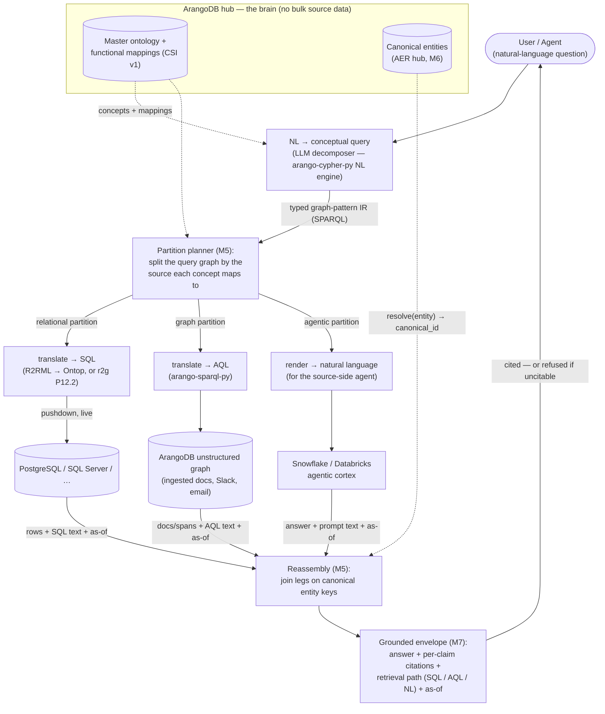
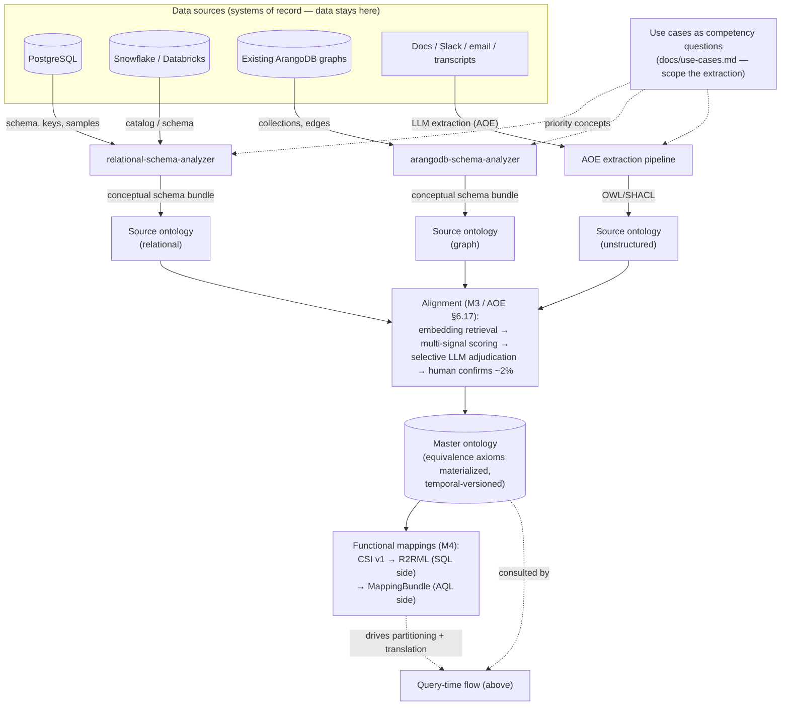

# Contextual Data Fabric

ArangoDB as an **ontology-based metadata / agent-brain hub**: auto-derive a use-case-driven ontology across structured + unstructured sources, and answer English questions by **federating queries across systems** — grounded and cited — **without moving the data**.

Part of **Project Vantage**. Built for and pressure-tested against the Zscaler customer-context engagement.

> **Status:** planning docs, draft v0.3, for team review. This repo currently holds the PRD, North Star, use cases, and per-module / per-repo architecture specs. Code modules land per the phased plan.
> **v0.2** reconciled all specs against the actual repos — the structured→ontology gate is resolved (exists); PRD §10 added cross-cutting requirements (evaluation, agent interface/MCP, consistency, partial failure, caching, security, deployment, pinning, packaging).
> **v0.3** absorbs the deep-analysis passes: **ADR-0001** decides the conceptual-query IR (typed graph-pattern → SPARQL; CSI v1 as the mapping hub; Ontop buy-vs-build open as PRD §9.10) — M5 is now mostly **integration of owned components** (`arango-sparql-py`, `arango-cypher-py`, RSA/`arangodb-schema-analyzer`); AOE PRD §6.17–§6.19 definitizes alignment / A-box / competency questions; use cases are formalized from PJ's 12 locked questions; `customer-context` is cloned + verified.

## Start here

- **[PRD](docs/contextual-data-fabric-prd.md)** — the near-term contract: vision → phased plan → **detailed Phase 1** (1-week federated-query goal) → referenced repos → open decisions → cross-cutting requirements (§10).
- **[North Star](docs/contextual-data-fabric-north-star.md)** — the end-state vision every phase ladders toward. The horizon to check scope against.
- **[Use Cases & Competency Questions](docs/use-cases.md)** — personas, interaction model, and the CQ table derived from the 12 locked questions (Q12 + Q2 proposed for the P1 demo).
- **[Architecture Index](docs/architecture/README.md)** — the "super-module": module map, module→repo dependencies, phase mapping, and the **building-block version pins**.
- **[ADR-0001 — Conceptual-query language](docs/architecture/module-05-federated-query-engine/adr/ADR-0001-conceptual-query-language.md)** + **[M5 implementation plan](docs/architecture/module-05-federated-query-engine/implementation-plan.md)** — the decided query architecture and the sequenced work packages (incl. the honest 1-week P1 slice).
- **[Phase-1 deployment topology](docs/architecture/deployment-p1.md)** — what physically runs where for the demo (build-time vs demo-time split).

## How it works

Two flows, sharing one artifact: the **aligned master ontology + its functional mappings**. The build-time flow (second diagram) produces that artifact from the sources' schemas; the query-time flow (first diagram) uses it to answer questions — without moving the data.

### Query time — from English to a cited, federated answer

A natural-language question is lifted into a **conceptual query** — a typed graph-pattern IR over the master ontology, serializing to SPARQL ([ADR-0001](docs/architecture/module-05-federated-query-engine/adr/ADR-0001-conceptual-query-language.md)). Because every concept/property in the ontology carries a mapping to the source(s) that realize it, **decomposition is graph partitioning**: the planner (M5) splits the query graph by source. Each partition is then translated into the *native language of its source* — **SQL** pushed down to relational systems (via R2RML/Ontop, or r2g's generator), **AQL** against the unstructured graph already in ArangoDB (via the owned `arango-sparql-py` transpiler), or **rendered back into natural language** for sources that expose an agentic interface (a Snowflake/Databricks cortex) rather than a query endpoint. Results come back and are **joined on canonical entity keys** (M6/AER — the guarantee that the Postgres account row and the Slack sentiment are about the *same* account), then wrapped by M7 into a **grounded envelope**: every claim cited with the actual SQL/AQL/agent-prompt that produced it, source objects, and an as-of timestamp — or a clean **refusal** if a claim can't be cited.

### Build time — derive the source ontologies, align them into one

Each source's **schema** is analyzed into a **source ontology**: relational schemas via `relational-schema-analyzer` (tables, keys, FKs → concepts/properties), existing ArangoDB graphs via `arangodb-schema-analyzer`, and unstructured corpora via AOE's LLM extraction pipeline — all scoped by the **competency questions** in [use-cases.md](docs/use-cases.md) (extract what the questions need, never boil the ocean). The per-source ontologies are then **aligned** (M3, AOE §6.17): embedding retrieval proposes cross-source correspondences, multi-signal scoring auto-resolves the clear cases, an LLM adjudicates only the borderline band, and a human confirms the last ~2%. The result is the **master ontology** — `customer account` ≡ `client account` ≡ `account`, with equivalence axioms materialized — plus the **functional mappings** (CSI v1, exported as R2RML for SQL and MappingBundle for AQL) that make the query-time partitioning and translation deterministic. The ontology is temporal-versioned: source changes cascade through belief revision rather than rebuilding.

## Modules

| # | Module | Spec |
|---|--------|------|
| M1 | Connectors | [spec](docs/architecture/module-01-connectors/specification.md) |
| M2 | Ontology Extraction | [spec](docs/architecture/module-02-ontology-extraction/specification.md) |
| M3 | Ontology Alignment | [spec](docs/architecture/module-03-ontology-alignment/specification.md) |
| M4 | Mapping Layer | [spec](docs/architecture/module-04-mapping-layer/specification.md) |
| M5 | Federated Query Engine | [spec](docs/architecture/module-05-federated-query-engine/specification.md) · [ADR-0001](docs/architecture/module-05-federated-query-engine/adr/ADR-0001-conceptual-query-language.md) · [plan](docs/architecture/module-05-federated-query-engine/implementation-plan.md) |
| M6 | Entity Resolution / Canonical Hub | [spec](docs/architecture/module-06-entity-resolution/specification.md) |
| M7 | Grounding & Provenance | [spec](docs/architecture/module-07-grounding-provenance/specification.md) |
| M8 | Governance / OBAC (future) | [spec](docs/architecture/module-08-governance-obac/specification.md) |
| M9 | Demo Harness | [spec](docs/architecture/module-09-demo-harness/specification.md) |
| M10 | Evaluation & Golden Set | [spec](docs/architecture/module-10-evaluation/specification.md) |

## Enhancement specs for existing repos

Requirement specs telling each existing Arango repo what it must add to serve the fabric:

- **r2g → federated query** — [spec](docs/architecture/_repo-enhancements/r2g-federated-query.md)
- **ontology-extractor → structured input + alignment/belief APIs** — [spec](docs/architecture/_repo-enhancements/ontology-extractor-structured.md)
- **AER → semantic + federation-aware ER** — [spec](docs/architecture/_repo-enhancements/aer-semantic-federated.md)
- **schema-analyzers → metadata sampling** — [spec](docs/architecture/_repo-enhancements/schema-analyzers-metadata-sampling.md)
- **customer-context → expose graph, grounding envelope & ontology-driven AQL** — [spec](docs/architecture/_repo-enhancements/customer-context-expose-modules.md)

## Phase 1 (≈1 week)

Demonstrate a **federated query across one relational database (live, not mirrored) + unstructured documents already ingested in Arango**, unified by an auto-derived, use-case-scoped ontology, returned grounded and cited with a retrieval path spanning both sources. Proposed demo questions: **Q12 (the "green metrics, red sentiment" centerpiece) + Q2** ([use cases](docs/use-cases.md)). See the [PRD §7](docs/contextual-data-fabric-prd.md) for the work breakdown and the [M5 implementation plan](docs/architecture/module-05-federated-query-engine/implementation-plan.md) for the P1 walking skeleton.

## Authoring new specs

Copy [`docs/architecture/_TEMPLATE-module-spec.md`](docs/architecture/_TEMPLATE-module-spec.md), fill it in, and reconcile it against the [Architecture Index](docs/architecture/README.md). PR per sub-module.

---

*Some docs use Obsidian `[[wikilink]]` syntax (authored in a vault). They render as plain text on GitHub; the links above are the GitHub-navigable index.*
