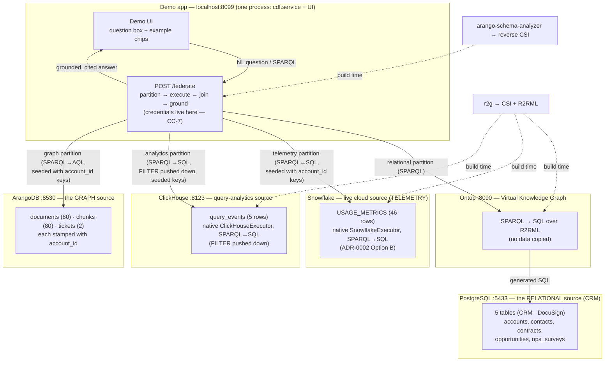

# Running the demo

The Contextual Data Fabric demo answers one conceptual question by **federating
four live sources** — Postgres (CRM), Snowflake (usage telemetry), ClickHouse
(query analytics), and ArangoDB (documents) — joining their results on a shared
business key and citing every fact, **without moving any data**.

> **What this proves:** the fabric's architecture, end to end — auto-derived
> mappings, cross-source query decomposition, a deterministic join, grounded
> citations, and honest refusals. It is an **internal / team** demo of the
> machinery. The customer-facing "green metrics, red sentiment" story (Q12)
> additionally needs the LLM extraction pass on the documents — see
> [Limitations](#limitations).

## Quick start

Prerequisites: **Docker Desktop running**, Python 3.10+, and the two owned
sibling libraries checked out under `~/code` (`arango-sparql-py`,
`arango-schema-analyzer`).

```bash
cd ~/code/contextual-data-fabric
make install        # once: create .venv, install engine + live-leg libraries
make demo           # bring up stacks, load data, run the gate, serve the UI
```

Then open **http://localhost:8099**, type a question (or click an example
chip), and hit **Ask**. `Ctrl+C` stops the web server; the databases keep
running (`make down` stops them, preserving data).

| Command | What it does |
|---------|--------------|
| `make install` | Create `.venv`, install the engine + live-leg libraries. Run once. |
| `make demo` | `up` → `seed` → `gate` → clear port 8099 → serve the browser UI. |
| `make gate` | Run the seven golden contract checks (g1–g7, incl. the three-source join and the native-ClickHouse FILTER/OPTIONAL leg) against the live stacks (the mandatory pre-demo check). |
| `make up` / `make down` | Start / stop the local Docker stacks — Postgres+Ontop, ArangoDB, and ClickHouse (data preserved on `down`; ClickHouse self-seeds on first create). Snowflake is a live cloud source loaded by `make seed`. |
| `make seed` | (Re)load the source databases (Postgres, Snowflake, ArangoDB) + emit the mappings. |
| `make test` | Lint + types + unit suite (what CI runs). |

## Topology — what runs where

The local stacks run on one machine; Snowflake is a live cloud source.
**Five local processes** — the demo app (engine **and** UI in one, on :8099),
Postgres, Ontop, ArangoDB, and ClickHouse — plus **one live cloud leg**
(Snowflake) and one build-time step. The databases are the systems of record; the
fabric holds only the mappings and the join — it never copies their data.



**The join:** the relational leg returns `account_id`; the engine pushes those
keys into the graph leg as a `VALUES` clause (a bind-join), so ArangoDB only
returns rows for the accounts in play. `account_id` is baked into both sides by
construction — a deterministic, document-level join, no fuzzy matching at query
time.

## What's in each database

### PostgreSQL (`crm`) — the structured / relational source
The synthetic CRM + contracts corpus for three accounts (Northwind =
healthy expansion, Meridian = hidden risk, Helio = churn). Loaded by
`deploy/ontop/load_corpus.py` from `customer-context/data_gen/output/structured/`.
The usage telemetry now lives in the live Snowflake source (below), so it is no
longer a Postgres table.

| Table | Rows | Source system | Holds |
|-------|-----:|---------------|-------|
| `accounts` | 3 | CRM | account name, segment, product tier, health score, ARR, `account_id` |
| `contacts` | 8 | CRM | people, titles, champion role, engagement status |
| `opportunities` | 16 | CRM | pipeline stage, amount, renewal date |
| `nps_surveys` | 35 | CRM | NPS **scores** (the numbers; the verbatims live on the graph side) |
| `contracts` | 15 | DocuSign | value, term, auto-renew, product scope, days-to-renewal |

Ontop exposes these as a Virtual Knowledge Graph: it answers SPARQL by
rewriting to SQL against the live tables through the **r2g-generated R2RML**
mapping (`deploy/ontop/input/mapping.ttl`) — nothing is copied out of Postgres.

### Snowflake (`TELEMETRY`) — the live cloud telemetry source
The usage-telemetry half of the corpus, loaded into a live Snowflake trial
account by `deploy/snowflake/load_corpus.py`. Physical names land uppercase
(Snowflake's identifier folding); CC-12's naming layer maps them to the
conceptual vocabulary (`USAGE_METRICS` → `UsageMetric`).

| Table | Rows | Source system | Holds |
|-------|-----:|---------------|-------|
| `USAGE_METRICS` | 46 | Snowflake | query volume, cluster size, edition, feature adoption |

The `UsageMetric` concept routes **uniquely** to Snowflake — `usage_metrics` was
dropped from the Postgres mapping so the planner sees exactly one owner per
concept. The leg is a **native `SnowflakeExecutor`** (ADR-0002 "Option B"): it
compiles the SPARQL partition straight to Snowflake SQL over
`snowflake-connector-python` (no Ontop/JDBC), driven by the r2g-generated R2RML.

### ClickHouse (`analytics`) — the query-analytics source
Per-account query telemetry — the high-volume analytics workload ClickHouse is
built for. Self-seeded by the container's `docker-entrypoint-initdb.d` on first
create (`deploy/clickhouse/seed.sql`); no `make seed` step needed.

| Table | Rows | Holds |
|-------|-----:|-------|
| `query_events` | 5 | per-account query events: `feature`, `query_count`, `avg_latency_ms`, `event_date` |

The `QueryEvent` concept routes uniquely to ClickHouse. Ontop has no ClickHouse
dialect, so the leg is a **native `ClickHouseExecutor`**: it compiles the SPARQL
partition — **including a pushed-down E1 `FILTER`** (e.g. `avgLatencyMs < 25`
compiles to `WHERE avg_latency_ms < 25`) — straight to ClickHouse SQL, driven by
the r2g-generated R2RML.

### ArangoDB (`cmf`) — the unstructured / graph source
The document corpus (Slack, email, docs, Gong transcripts) for the same three
accounts. Loaded by `deploy/arango/load_corpus.py` from
`customer-context/data_gen/output/unstructured/`.

| Collection | Count | Holds |
|------------|------:|-------|
| `documents` | 80 | one per source file: `account_id`, source (slack/email/docs/gong), `citable_url`, role, `questions_served`, `event_date` |
| `chunks` | 80 | paragraph-bounded text, each carrying `document_id` **and** the denormalized `account_id` stamp |
| `tickets` | 2 | a small typed collection linked to two corpus accounts |

The `arango-sparql-py` transpiler answers SPARQL by generating AQL against
these collections, driven by the **analyzer-generated reverse CSI**
(`deploy/csi/arango-cmf.json`).

## The example questions

Shown as clickable chips in the UI (resolved from `deploy/questions.json`):

- **"for each account, what product tier are they on?"** — a **structured-only**
  question: answered entirely from Postgres. The trust-building anchor: clean,
  fully-sourced, single-leg.
- **"for each account, what documents do we hold and where did they come from?"**
  — a **cross-graph** question: joins the 3 Postgres accounts to their 80
  ArangoDB documents on `account_id`. This is the federation story — two
  databases, one answer, every row cited with its source URL.
- **"at each account's peak usage quarter, how is volume trending, and what do
  the signal documents say?"** — the **three-source flagship** (golden g5):
  joins `Account` (Postgres) ⋈ `UsageMetric` (Snowflake) ⋈ `Document` (ArangoDB)
  on `account_id`. One answer reconciled across a relational CRM, a live cloud
  warehouse, and a document graph — every leg cited with the exact SQL/AQL that
  ran.
- **"which query events stayed under 25 ms, and the document filenames if any?"**
  — the **pushdown showcase** (golden g7): joins `QueryEvent` (ClickHouse) ⋈
  `Document` (ArangoDB) on `account_id`, with the latency `FILTER` compiled into
  ClickHouse SQL (`WHERE avg_latency_ms < 25`) and the filename as an `OPTIONAL`.
  The E1 single-leg FILTER/OPTIONAL pushdown, live on a fourth engine. (Ask it in
  English via the NL front-end, or run the SPARQL in the Advanced box.)

The answer panel shows the status badge (`grounded` / `refused` / `partial`),
the per-source partition (the actual SQL and AQL that ran, source objects,
as-of timestamps, row counts), and the joined result.

## Limitations (what this demo does *not* yet show)

- **Free-form English.** The LLM NL front-end **is implemented and wired**
  (`src/cdf/query/nl.py` + `POST /nl-preview`): `from_env` enables it whenever an
  API key is present (`OPENAI_API_KEY` / `ANTHROPIC_API_KEY` / `NL2SPARQL_API_KEY`
  — one is set in `.env`), so `make demo` runs with free-form NL **active**. It is
  pinned **off** only in the deterministic `make gate` (`CDF_NL_DISABLED`), where
  every leg must be reproducible. Without a key it falls back to the fixed
  registry of questions (the M9 "pre-run" mode), where an unlisted question
  **refuses honestly** rather than guessing.
- **The Q12 centerpiece** ("every metric green, but the sentiment is red").
  The documents are loaded as citable text, but their *sentiment/entities* are
  not yet extracted — that is `customer-context`'s LLM extraction pipeline
  (WP-P1.3-full). The join contract is identical, so it drops in without engine
  changes.

## Troubleshooting

| Symptom | Fix |
|---------|-----|
| `No rule to make target 'demo'` | You're in the wrong directory — `cd ~/code/contextual-data-fabric` (not `customer-context`). |
| `address already in use` on :8099 | A previous UI is still running. `make demo` now clears it automatically; or run `make free-ui`. |
| A leg shows `failed` in the answer | That stack is down — `make up`, then retry. (The engine *declares* the failed leg rather than hiding it — that's the intended behavior.) |
| Ports clash with other local containers | Override, e.g. `make demo CDF_ARANGO_PORT=8531 CDF_POSTGRES_PORT=5434 CDF_ONTOP_PORT=8091`. |

See also the per-stack notes in [`ontop/README.md`](ontop/README.md) and
[`arango/README.md`](arango/README.md), and the architecture-level
[deployment topology](../docs/architecture/deployment-p1.md).
