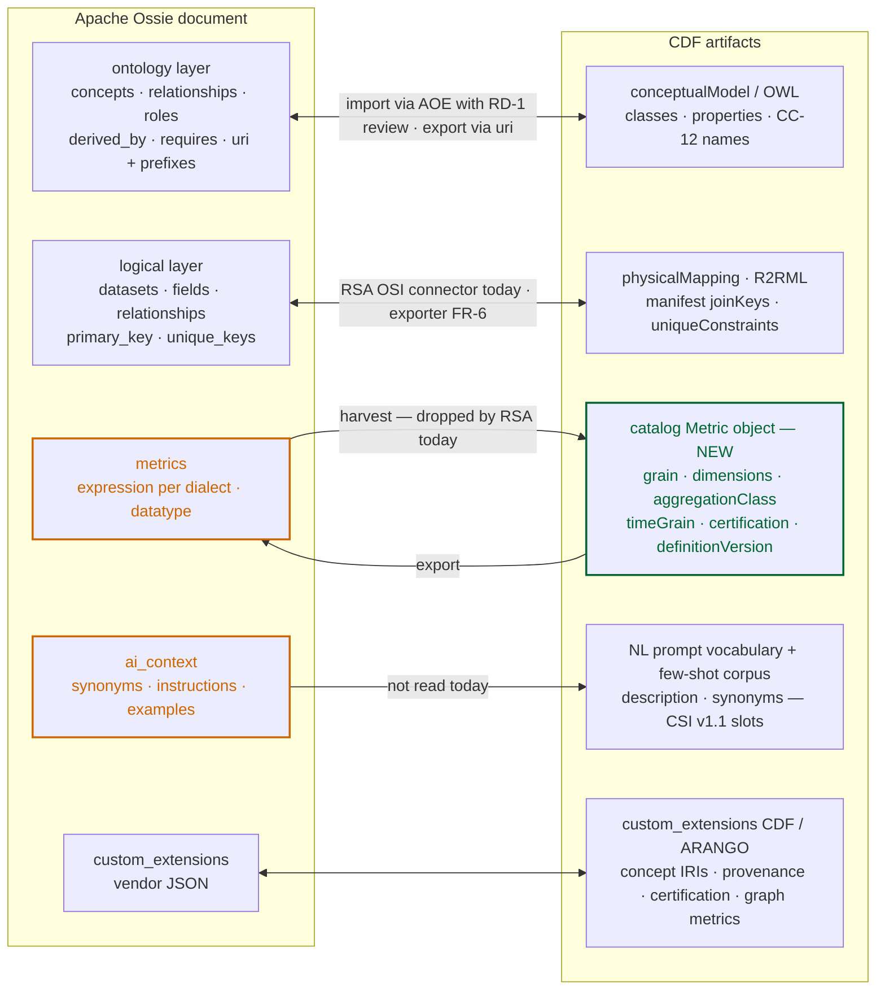
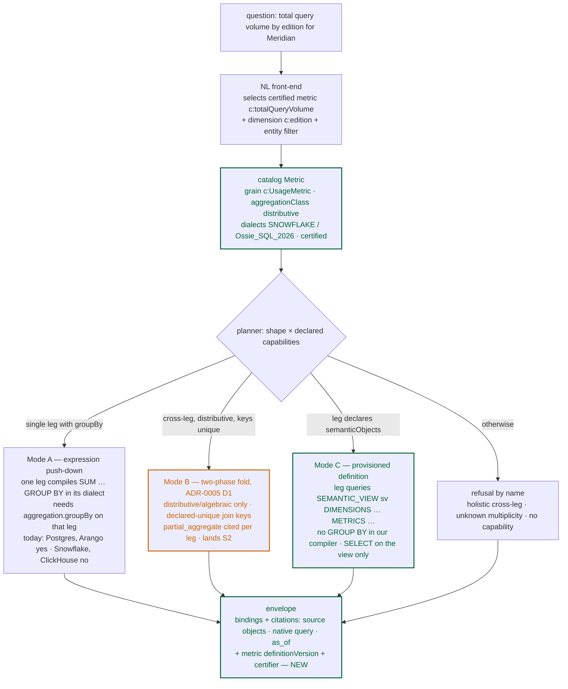
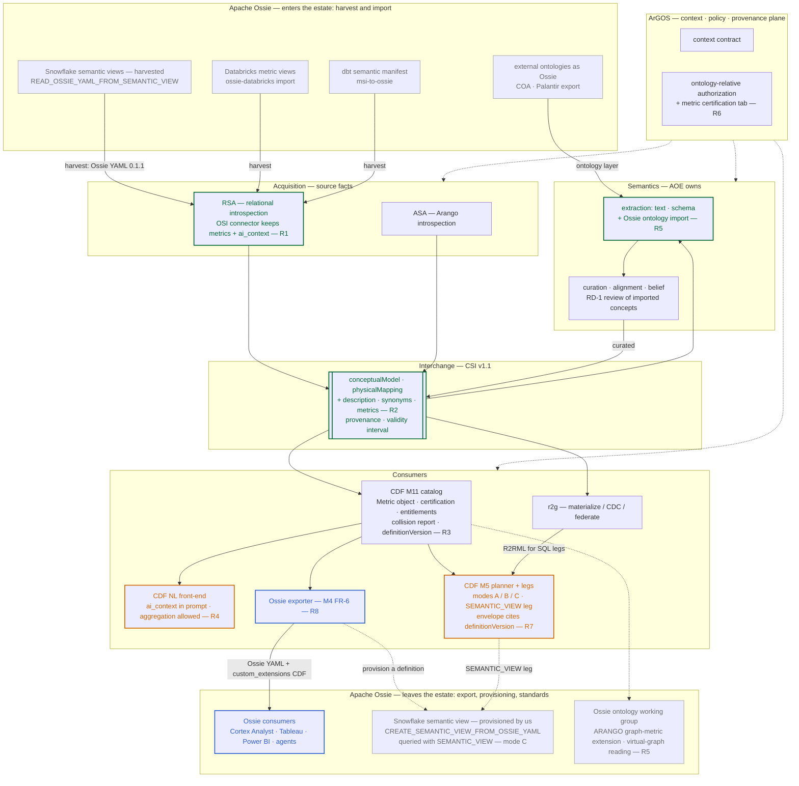

# Open Semantic Interchange (Apache Ossie) in the fabric

## Executive overview

**The problem.** Every enterprise we sell into already defines its business
metrics — active seats, renewal risk, total query volume — inside warehouse
semantic layers and BI tools, and every tool defines them differently. The
fabric answers questions over an ontology but has **no notion of a metric**:
asked "total query volume by edition for Meridian," it must either re-invent
the definition or refuse. The customer's certified definitions sit in
Snowflake, Databricks, dbt and Tableau, and today we cannot read them or
hand ours back.

**Why Ossie.** Apache Ossie (formerly Open Semantic Interchange) is the
vendor-neutral format that 50+ vendors — Snowflake, Databricks, dbt,
Salesforce, Denodo, Starburst among them — now use to exchange exactly these
definitions. Snowflake already emits it from any semantic view with one
function call (in preview). Adopting it means we **consume the customer's
governed definitions instead of asking them to re-author in ours**, and we
can publish our ontology back into the tools they already pay for. It is a
second versioned artifact crossing boundaries the estate already has, not a
re-platforming.

**What we recommend.** Three moves, in this order, plus one enabling fix:

1. **Harvest** — read customers' metric definitions through the connector we
   already ship (today it discards them).
2. **Govern** — add a *certified metric* to the fabric catalog: one owner,
   a declared grain, a steward's certification, and a definition version
   cited in every answer, so a metric answer shows its work like every
   other answer does.
3. **Export** — publish our ontology and metrics as Ossie so Cortex Analyst,
   Tableau, Power BI and customer agents consume them unchanged.

The enabling fix is to let the natural-language front-end use the
aggregation the engine already supports. The three moves fit the current
roadmap through January; the deeper engine work follows in H1 2027. Nothing
lands on the critical path of the sprint gates already committed.

**Results we will see.** A CSM asks a plain-English question and receives
the customer's own certified number — the same one their warehouse shows —
with the definition and its certifier cited. Onboarding a customer with an
existing semantic layer starts from their definitions, not a blank ontology.
Our ontology becomes visible inside the customer's BI tools. And Arango
takes the seat on the graph-and-ontology question that no one else at the
Ossie table represents.

**What to know before saying yes.** The spec is a draft in Apache
incubation; we pin the version we consume and carry our additions as
extensions where the standard is unsettled. The one leg holding harvestable
metrics today cannot aggregate; the recommended path around it uses
Snowflake's own semantic views rather than new engine code.

> **The ask (Arthur, 2026-09-15):** research OSI integration into CDF against
> eight questions — 3.1 effect on NL→SPARQL, 3.2 how OSI definitions enter CDF
> (does it extend the ontology?), 3.3 federator push-down of definitions,
> 3.4 harvesting definitions from source systems, 3.5 definitions for graph
> algorithms (Arango, virtual graph), 3.6 auto-generated query templates,
> 3.7 human-in-the-loop implications, 3.8 scheduling. Seeded with a Gemini
> note, treated as a map, not as evidence.
>
> **Method.** Primary sources read 2026-09-16: the `apache/ossie` repository
> (core `spec.md` 0.2.0.dev0, `ontology/ontology.md` + `ontology.json`,
> `core-spec/expression_language.md`, `core-spec/ossie-schema.json`,
> `converters/*/README.md`, `ROADMAP.md`, `DISCLAIMER`), the ASF incubator
> status page, Snowflake's function and semantic-view docs, GitHub
> discussions #22, #53, #68, #82, #101 and issue #107; plus a code read of
> what the estate already does with OSI (RSA 0.8.0 `connectors/osi.py`, the
> CSI v1 JSON schema, CDF `src/cdf/query/nl.py`, `planner.py`,
> `catalog/capabilities.py`, `grounding.py`, `deploy/catalog/manifest.json`,
> `deploy/questions.json`, the NL corpus and goldens). Claims resting on
> press or blog coverage are marked `[secondary]`; proposed-but-unadopted
> spec fields are marked `[proposed]`. The standard itself is profiled in
> the companion [standard profile](osi-apache-ossie-standard-profile.md).
>
> **Revision note (v0.3, same day).** Executive overview added at Arthur's
> request. **v0.2:** A self-review found two overstated
> claims and five omissions in v0.1. Corrected: aggregation *is* reachable
> through NL via the deterministic route (two of ten prepared questions
> aggregate) — the gap is in the LLM generation path (§5.1); the Snowflake
> and ClickHouse legs declare **no** GROUP BY capability, so the leg where
> harvestable metrics live cannot aggregate today (§5.3). Added: the three
> questions the eight skip (§1), governance and citation of metric answers
> (§5.7), time semantics, a risks table (§7), success measures (§8), and
> three diagrams — the concept mapping (§4), the metric-question flow (§5.3)
> and the recommendations superimposed on the estate's target architecture
> (§6).

## 0. Answers at a glance

| # | Question | Short answer | Lands in |
|---|---|---|---|
| 3.1 | NL→SPARQL effect | Metrics become **named targets**: the LLM selects a certified metric and slices it by dimensions instead of composing aggregates. Helps only if (a) `ai_context`/descriptions reach the prompt (today it carries names only) and (b) the generation path is allowed to aggregate (today the prompt forbids what the planner admits single-leg; only the two prepared aggregation questions get through). | `nl.py` prompt + corpus; M10 eval |
| 3.2 | Extend the ontology? | **No — three artifacts, not one.** Ossie's *ontology layer* ↔ our OWL/CSI conceptual model; its *logical layer* ↔ CSI physical mapping + R2RML; its *metrics* ↔ a **new catalog object** (`Metric`), not an OWL axiom. | M11 catalog; CSI v1.1; FR-6 |
| 3.3 | Push-down | Definitions are not pushed at query time; three modes: **expression** push-down per dialect (blocked on Snowflake/ClickHouse today — their legs declare no GROUP BY), **two-phase** cross-leg per ADR-0005 (S2), and **provisioning** — the leg queries the source's own semantic object (`SEMANTIC_VIEW(...)` on Snowflake), which needs no aggregation in our compiler at all. | M5 planner, capability registry, M13 dial |
| 3.4 | Harvest | **Yes — the near-term win.** Snowflake exports any semantic view as Ossie YAML (preview, 0.1.1); Databricks metric views and dbt manifests convert with recorded loss; Postgres/ClickHouse/Arango have only schema to harvest. RSA's connector drops the metrics on the way in. | RSA OSI connector |
| 3.5 | Graph algorithms | **No objects, none planned.** Footholds: recursive `derived_by` rules (reachability, not PageRank) and an `ARANGO` `custom_extensions` slot exposing algorithm *results* as fields. Ossie's ontology layer is, however, a vendor-neutral **virtual-graph schema** — the same shape as CSI and PuppyGraph's schema JSON. | Ontology WG proposal; M13 |
| 3.6 | Templates | Yes — as our prepared questions, few-shot corpus and goldens, generated per metric × dimension, **admission-filtered and execution-graded** before entering the corpus. | `questions.json`, `nl-corpus`, Forge |
| 3.7 | HITL | Three gates, two already named (RD-1, RD-3) plus **metric certification**, which Ossie does not model; and two things v0.1 missed — metrics are **governable objects** M8 has no notion of, and a metric answer must **cite its definition version**, which the envelope cannot carry today. | PRD §12; M8; envelope; ArGOS |
| 3.8 | When | **Not before S2's rung-3 fold and the catalog-as-hub.** Cheap slices now (misnomer fix, RSA connector, pin, harvest spike); NL aggregation gap S3–S4; `Metric` object + Ossie export S6; push-down modes and the graph proposal H1-2027. Ossie is a 0.2.0.dev0 draft in incubation — pin, don't chase. | roadmap S2/S3/S6, H1-2027 |

## 1. Are these the right questions?

The eight are engineering questions — *how* would OSI enter the fabric. They
are the right eight for a design, and this paper answers them. But three
prior questions decide which of the answers matters first, and the seed did
not ask them.

**Q-A. Which goal are we buying?** "OSI compliance surfaced" (PRD §6) can
mean three different things, each with its own first slice and its own
success measure:

| Goal | First slice | We would know it worked when |
|---|---|---|
| **Import** — respect the definitions customers already govern (Snowflake semantic views, dbt metrics) instead of re-deriving them | harvest via RSA (§5.4) | a customer's certified metric answers through the fabric with the same number the source shows |
| **Export** — make the fabric's ontology and metrics consumable by the BI/AI tools the customer already runs (Cortex Analyst, Tableau, Power BI, agents) | Ossie exporter, M4 FR-6 (§6 R8) | our export loads into a third-party tool unchanged, and that tool's answer matches ours |
| **Position** — be the ontology-and-federation player at a table otherwise made of semantic-layer and warehouse vendors | the graph/virtual-graph contribution to the ontology working group (§5.5) | Arango is named in the roadmap's non-tabular work |

The paper's recommendation is **import first**, because it is the only goal
with a customer-shaped test today and because the harvest is one call away;
export second, because it is cheap and it is the OKF report's "Lane C" move
played toward a standard with fifty members; positioning as a by-product.

**Q-B. Who is the authority when definitions disagree?** A harvested
`total_revenue` and a curator-authored `c:totalRevenue` will differ, and two
Snowflake semantic views over the same tables will both define "active
seats". The estate already has the rule for concepts — **single-owner
ownership** (each concept owned by exactly one source; the Snowflake sprint
moved `UsageMetric` out of the Postgres CSI for this reason) and the label
collision report (`deploy/catalog/label-collisions.md`). Metrics need the
same two mechanisms: one owning definition per metric name, and a
**metric collision report** at admission (same name, different expression
or grain). Without Q-B answered, harvesting is an ingestion of contradictions.

**Q-C. What happens to "no black boxes" when the source computes the
metric?** Provisioning (§5.3 mode C) is the strongest "write once, query
anywhere" story and the only mode where the Snowflake leg can aggregate
today — but the leg then cites a semantic view, not rows. The fabric's
thesis (north star principle 2) requires the envelope to show the work.
The answer is that the **definition travels with the answer**: the envelope
cites the Ossie definition text and version alongside the view. That is a
new citation field (§5.7), and it is the reason metric certification cannot
be optional.

Two more belong inside the answers rather than beside them and were absent
from v0.1: **time** (nearly every metric that matters here is a time series —
Q15 "usage trend over time" — so a metric needs a time grain and the answer
an `as_of`; Ossie has only `is_time`; the fabric has CC-4 as-of semantics and
bitemporal CSI stamps) and **governance** (metrics are objects M8 does not
know; §5.7).

## 2. What OSI is today — in brief

The evidence sits in the companion
[standard profile](osi-apache-ossie-standard-profile.md); the facts the rest
of this paper leans on are:

- **Identity.** Announced by Snowflake 2025-09-23 with 17 participants;
  spec "live" 2026-04-28 (tag `osi-0.1.1-rc1`); entered the **Apache
  Incubator on 2026-06-22 as Apache Ossie**. 50+ members including
  warehouses, BI and semantic-layer vendors, catalogs, the federation
  vendors Denodo, Starburst and Dremio, and RelationalAI. Arango is not one.
- **Two layers.** A **logical layer** (`semantic_model` → `datasets`,
  `fields`, `metrics`, `relationships`, `ai_context`, `custom_extensions`;
  SQL pass-through per dialect; core spec `0.2.0.dev0`, DRAFT) and an
  **ontology layer** (`ontology/ontology.md`, `0.2.0.dev0`, 2026-05-29:
  ORM-style concepts and n-ary relationships with `derived_by`, `requires`,
  `verbalizes`, a `uri`/`prefixes` hook, and R2RML-shaped
  `ontology_mappings` from datasets to concepts).
- **Expression language.** `Ossie_SQL_2026` ("Proposed Final"): an ANSI
  SQL:2003 Core subset for metrics, fields and filters — no
  `SELECT/FROM/JOIN/GROUP BY/WHERE` — with a **decomposability table**
  (distributive / algebraic / holistic / sketch) identical to ADR-0005's.
- **Relationships** are implicitly many-to-one with the `to` side keyed —
  the declared-unique one-side ADR-0005 D1 requires.
- **Absent by design or not yet:** RDF/OWL serialization, per-object
  provenance/owner/version/**certification** (#53 open, no replies),
  entitlement or PII markers, metric grain and filters, graph or document
  sources (#68), a query language, `verified_queries` (#82).
- **Tooling.** Pydantic models, a JSON-schema validator, converters for
  dbt and Databricks (bidirectional), Snowflake (export only — Snowflake
  ships the import side itself, §5.4), Power BI, GoodData, Palantir
  ontologies, and more.
- **Caveats that bind us.** Incubator licensing disclaimer; pre-release
  schema may change; no schema versioning yet — parse behind one seam under
  CC-9 pin discipline.

## 3. Where the estate already touches OSI (code read, with corrections)

1. **RSA 0.8.0 has an OSI connector — as a *physical* catalog source.**
   `relational_schema_analyzer/connectors/osi.py` reads `*.osi.yaml` into a
   `PhysicalSchema`: `datasets[]` → Table (`source` → schema hint +
   `extra['osiSource']`, `description` → comment), `fields[]` → Column
   (declaration order → ordinal; **types degrade to `string`/`temporal`**
   because Ossie carries none), `primary_key`/`unique_keys` → keys,
   `relationships[]` → ForeignKey, document `generated_at`/mtime → bitemporal
   valid time. Two lines matter for this report: *"Model-level `metrics` are
   aggregate expressions, not physical columns, so they are intentionally
   ignored"*, and `ai_context` is never read. The estate ingests Ossie
   **minus exactly the semantic content the eight questions are about**. A
   correct scoping for a read-only introspector, and the seam to extend.
2. **r2g has no OSI code.** Zero references in `r2g/src/r2g` or `r2g/docs`.
   The PRD's "`r2g` … **implements OSI**" (§9) and the module specs'
   "OSI/YAML" artifact language (M2 §3, M3 §3, M4 §2/§9, M5 §3) describe an
   intent; the shipped interchange is **CSI v1** (ADR-0001 #3), and the
   Ossie import path is RSA's connector → `catalog/adapters/rsa.py` → CSI.
   M4 **FR-6 "OSI-compliant export/import" (P2) is unstarted.**
3. **CSI v1 has nowhere to put what Ossie carries for the LLM.** The schema
   (`schema_analyzer/csi/v1/csi.schema.json`) declares entity `name`,
   `labels`, `properties`; relationship `type`, `fromEntity`, `toEntity`;
   property items are an **open object** — `sampleValues` rides ad hoc — and
   there is no `description` or `synonyms` slot at any level. Descriptions,
   synonyms and metrics are therefore **CSI v1.1 additive extensions**, to be
   filed next to the seven in the unified paper's §8.1.
4. **The capability registry is live and says the metric leg cannot
   aggregate.** `deploy/catalog/manifest.json` carries ADR-0005 D4 blocks for
   all four sources: `postgresql:crm` and `arango:cmf` declare `groupBy:
   true`; **`snowflake:telemetry` and `clickhouse:analytics` declare
   `groupBy: false`**, and their native executors refuse aggregation by
   docstring. The one leg holding harvestable metric definitions is the one
   leg that cannot run them today (§5.3).
5. **The envelope cites rows, not definitions.** `Citation` carries
   `source_id`, `kind`, `sparql`, `native_query`, `source_objects`, `as_of`,
   `row_count` and resolution/authorization events; neither it nor
   `AnswerEnvelope` carries a mapping or CSI version. M4 FR-7's "a
   version/hash that is cited in the answer envelope" is not evidenced in
   the types; a metric answer would have nothing to cite its definition with.
6. **Governance has no metric object.** `governance/contracts.py` and
   `pdp.py` know concepts, properties, rows and citations; no aggregate or
   metric appears. Entitlements on metrics would be new (§5.7).
7. **The name.** PRD §5 and the north-star principle 7 expand OSI as "open
   semantic inter*face*". It is the Open Semantic Inter*change*, now Apache
   Ossie.
8. **Competitors already speak it.** AWS's context-ontology-accelerator
   ships OSI import/export in its metric editor (COA report §4/§6); the
   report's "interop counter-demo" (their ontology, our federation) is the
   Ossie *ontology layer* import, not the metrics layer.

## 4. Concept mapping — Ossie ↔ CDF



*Green = the new object this paper proposes; orange = carried by Ossie and
dropped or unread by the estate today.*

| Ossie | CDF artifact today | Fit |
|---|---|---|
| `semantic_model` | catalog manifest source (`deploy/catalog/manifest.json`) | direct |
| `dataset` (`source`, `primary_key`, `unique_keys`) | CSI entity + `arangoPhysicalMapping` / R2RML logical table; manifest `uniqueConstraints` | direct (RSA does this) |
| `field` (`expression`, `datatype`, `is_time`) | CSI property + physical field; `sampleValues` | direct; **Ossie has no sample values, CSI has no synonyms or descriptions** |
| `relationship` (many-to-one, `to` keyed) | CSI relationship / R2RML `refObjectMap`; manifest `joinKeys` | direct — and the `to`-side key is exactly the **declared-unique one-side ADR-0005 D1 requires** |
| `metric` | **nothing** — the fabric has no metric layer (scorecard dim. 2 gap) | new object (§5.2) |
| `ai_context.{synonyms,instructions,examples}` | nothing — `SourceCatalog.vocabulary()` emits class and property *names* only | new prompt inputs (§5.1) |
| `custom_extensions[VENDOR]` | — | our slot: `CDF`/`ARANGO` extension for concept IRIs, provenance, certification, graph metrics |
| ontology `concept` (`EntityType`, `extends`, `uri`) | OWL class, `rdfs:subClassOf`, IRI under `urn:arango-sparql:concept#`; CC-12 singular PascalCase already matches (`Person`, `OrderLineItem`) | mechanical for classes |
| ontology `concept` (`ValueType`, `requires`) | datatype + SHACL constraint | mechanical |
| relationship, binary | object/datatype property (`c:accountId`) | mechanical; `verbalizes` ≈ `rdfs:label`/comment — and excellent few-shot fodder |
| relationship, n-ary; `derived_by` | reified class / SPARQL CONSTRUCT or view | partial — not lossless either way |
| `identify_by` | AER canonical key / declared join key | strong match |
| `ontology_mappings` (object/link mappings) | R2RML / CSI physical mapping | same shape, different spelling — a **virtual-graph schema** in both cases (§5.5) |

## 5. The eight questions

### 5.1 (3.1) How do OSI metric definitions affect NL→SPARQL?

**Where the NL front-end stands.** Two routes answer a question. The
**deterministic route** exact-matches `deploy/questions.json` (10 prepared
questions, **two of which aggregate**: "how many accounts are on each
product tier?", "how many signal documents are there per source?"). The
**generation route** (`src/cdf/query/nl.py`) grounds an LLM prompt in the
caller's authorized projection of the catalog — per source, per class, the
property names plus relationship names — validates the output with
`partition_query`, repairs up to twice, then refuses. Two facts bound what a
metric layer can do on the generation route:

- The prompt carries **names only** — no descriptions, synonyms or example
  questions, because CSI v1 has no slot for them (§3.3). Ossie's
  `ai_context` and `description` are precisely the missing inputs.
- The prompt says *"Do NOT use … aggregation (COUNT/SUM/GROUP BY) — those
  are refused by the engine"*, and the docstring repeats "E1 still refuses
  … aggregation". **The engine no longer does:** `planner.py`
  `_admit_single_leg_aggregation` (issue #14, rung 2) admits a top-level
  `GROUP BY` routed to one aggregation-capable source, and goldens g19
  (Ontop) and g20 (Arango) pin it. The NL corpus (`nl-corpus-v1.json`, 12
  examples) has **zero** aggregation examples. So an aggregate question that
  is not one of the two prepared ones cannot reach the engine through
  generation, although the engine could run it on Postgres or Arango. This
  gap predates OSI and is the first thing metrics would have to pass through.

**What metrics change — three effects.**

1. **The target set shrinks and gets named.** With certified metrics in the
   catalog, "total query volume by edition for Meridian" is *metric selection
   + dimension slicing + entity filter*, not free composition of `SUM` over
   the right property at the right grain. The LLM picks `c:totalQueryVolume`
   (defined once as `SUM(usage_metrics.query_volume_m)` at `UsageMetric`
   grain) rather than inventing it. Synonyms (`ai_context.synonyms: ["query
   volume", "queries"]`), `verbalizes` patterns from the ontology layer and
   `examples` feed the retrieval seam the few-shot machinery already has.
   This is the mechanism behind the seed's "reduces hallucinations" claim —
   real, but it works through vocabulary and target reduction, not through
   OSI per se, and it needs the prompt to carry the fields.
2. **The IR needs a way to say "this metric".** Two options, both
   compatible with SPARQL as canonical IR (ADR-0001):
   - *Expand at generation time* — the definition is macro-expanded into a
     SPARQL aggregate (`SELECT ?edition (SUM(?v) AS ?total) … GROUP BY
     ?edition`). Works when the expression fits the admitted fragment and the
     shape is single-leg on a `groupBy: true` leg (rung 2) or distributive
     cross-leg over declared-unique keys (rung 3, S2). Nothing new in the
     engine; the template is the artifact (§5.6).
   - *Treat the metric as a derived property* (`c:totalQueryVolume` on a
     `c:UsageSummary` class) realized by a source-side object — a Postgres
     view or Ontop lens, a Snowflake semantic view, a Databricks metric view.
     No aggregation in the IR; the source computes its own governed
     definition (§5.3 mode C). This keeps NL inside the BGP+FILTER fragment
     the prompt already teaches, and it is the only option that works on the
     Snowflake leg today.
3. **Refusals become more precise, not fewer.** A metric carries its
   aggregation class. Distributive/algebraic metrics are admissible cross-leg
   under ADR-0005 D1; holistic ones (percentiles, MEDIAN, COUNT DISTINCT
   across legs) are **permanently refused cross-leg** (D3). The refusal can
   name the metric and the class ("`p95Latency` is holistic; it runs
   single-leg on Snowflake only") — better than today's "aggregation".

**Time.** Metrics here are mostly series (Q15 "usage trend over time"). The
metric object needs a `timeGrain` (period, quarter) and the answer an
`as_of` — CSI already stamps validity intervals and the envelope's `Citation`
already carries `as_of` per leg. Ossie contributes only `is_time`; grain
comes from us.

**Verified queries ≈ our NL corpus.** Ossie's proposed `verified_queries`
(#82) and Snowflake's shipped ones (`name`, `question`, `sql`, `verified_at`,
`verified_by`, `use_as_onboarding_question` — "example questions with their
corresponding SQL queries … help Cortex Analyst understand how to answer
similar questions") are the same idea as `CorpusExample` (`question`,
`aliases`, `sparql`, `expected_sources`, `refusal`). The #82 objections —
staleness, "belongs in an evals pipeline", "required groupings are a
property of the metric" — are all things `cdf.eval` already handles. Interop
is an exporter, not a redesign.

**Seed check.** "Drastically improves … reducing hallucinations and
ambiguous mapping" — directionally right, unevidenced, and conditional on
the two facts above. The honest measure is the NL eval (M10) before and
after enrichment, on a corpus that finally includes aggregation questions.

### 5.2 (3.2) How do OSI definitions enter CDF — does it extend the ontology?

**Answer: three Ossie artifacts land in three CDF places; only one of them
is "the ontology"** (diagram, §4).

| Ossie artifact | Enters CDF as | Why here |
|---|---|---|
| **Ontology layer** (`concept`, `relationships`, `extends`, `requires`, `uri`) | the **conceptual model** — OWL/CSI `conceptualModel`, classes and properties under the concept base, CC-12 names | it *is* an ontology; `uri`/`prefixes` is the interop hook; import ≈ another extraction source for M2/M3 (review-gated, §5.7) |
| **Logical layer** (`datasets`, `fields`, `relationships`, `primary_key`) | **CSI physical mapping + R2RML + manifest `joinKeys`/`uniqueConstraints`** | RSA's connector already does this; nothing conceptual about a `db.schema.table` binding |
| **Metrics** (`metrics[]`, per-dialect expressions, `ai_context`) | a **new catalog object class `Metric`** in the M11 catalog graph — not an OWL axiom | OWL cannot express aggregation semantics; SHACL-AF/SPARQL rules could, but would not round-trip to Ossie; the catalog is where the planner already reads capabilities, join keys and statistics |

Proposed shape (manifest `metrics[]` + CSI v1.1 extension, serialized 1:1 to
Ossie `metrics[]` for FR-6):

```yaml
metrics:
  - name: totalQueryVolume            # CC-12 lowerCamel; Ossie name on export: total_query_volume
    owner: snowflake:telemetry        # single-owner rule extended to metrics (Q-B)
    concept: c:UsageMetric            # grain — the class whose instances are summed
    dimensions: [c:edition, c:period] # allowed GROUP BY properties
    timeGrain: c:period               # the time dimension, if any
    aggregationClass: distributive    # distributive | algebraic | holistic | sketch (ADR-0005 D1/D3)
    expression:
      dialects:
        - dialect: Ossie_SQL_2026
          expression: SUM(usage_metrics.query_volume_m)
        - dialect: SNOWFLAKE
          expression: SUM(USAGE_METRICS.QUERY_VOLUME_M)
    realizedBy:                        # mode C binding, when provisioned (§5.3)
      kind: snowflake-semantic-view
      object: TELEMETRY.PUBLIC.USAGE_SV
    aiContext:
      synonyms: [query volume, total queries]
      examples: ["total query volume by edition last quarter"]
    entitlements: {concepts: [c:UsageMetric], accessModifier: public}   # M8 sees it (§5.7)
    certification:                    # ours — Ossie has no slot (§5.7); emitted as custom_extensions[CDF]
      state: certified                # proposed | certified-by-source | certified
      certifiedBy: steward@…
      certifiedAt: 2026-09-16
    definitionVersion: sha256:…       # cited in the envelope (§5.7)
    provenance: {harvestedFrom: snowflake:telemetry, ossieVersion: 0.1.1, importedAt: …}
```

Two notes. First, until the metrics working group lands grain and dataset
references (#12, #18), the `concept`/`dimensions`/`timeGrain` binding travels
in `custom_extensions[CDF]` on export — lossless for us, ignorable for
others. Second, the ontology-layer import is the **COA counter-demo** path: a
Palantir or COA ontology exported as Ossie enters M2/M3 as a source ontology
with provenance, is curated (RD-1), and is then federated by us.

**Seed check.** "OSI acts as an overlay or an extension to your base
ontology" — half right for the logical and metric layers, and misses that
Ossie now carries its own ontology layer that maps onto ours rather than
extending it.

### 5.3 (3.3) How does the federator push definitions down into sources?

The seed is right that nothing is "pushed into" a source at query time. What
happens splits into three modes; the diagram shows how a metric question
would route through them.



**Mode A — expression push-down (per leg, per dialect).** The metric's
`expression.dialects` gives the leg its text: Ontop takes `ANSI_SQL`, a
future `SnowflakeExecutor` path would take `SNOWFLAKE`, ClickHouse
`ANSI_SQL`, and the Arango leg has **no Ossie dialect** — `arango-sparql-py`
already translates SPARQL aggregates to AQL for the single-leg case, so the
portable subset → SPARQL → AQL path is the one to use; there is no `AQL`
dialect tag to propose upstream until the ontology working group's
non-tabular work exists. **Today this mode is available only on Postgres and
Arango** (`groupBy: true`); the native Snowflake and ClickHouse executors
compile BGP + FILTER only and declare `groupBy: false` (§3.4). Giving the
Snowflake executor a GROUP BY path is executor work with a probe (CC-14)
before the capability may be declared. The registry gains two declarations:
`expressionDialects: [SNOWFLAKE, ANSI_SQL]` and `semanticObjects: {kind:
snowflake-semantic-view | databricks-metric-view | view | none}`.

**Mode B — two-phase cross-leg (ADR-0005 D1, roadmap S2).** A metric's
`aggregationClass` decides admissibility: distributive/algebraic partials
per leg, keyed by (grouping keys ∪ cross-source join keys), folded in the
federator; holistic refused by name. Ossie's relationships are many-to-one
with the `to` side keyed, so **importing Ossie relationships populates the
declared-unique one-side that D1 requires** — the Ossie import is
retroactively a prerequisite of rung 3, as the CRM overlay was. Because
Ossie metrics carry no grain, the partial-aggregation keys come from *our*
`concept`/`dimensions` binding, never from the harvested document alone.

**Mode C — provisioning the definition into the source.** "Write once,
query anywhere" in the strong sense: emit the metric as the source's own
governed object and query it as a plain property. On Snowflake the leg
issues

```sql
SELECT * FROM SEMANTIC_VIEW(
  TELEMETRY.PUBLIC.USAGE_SV
  DIMENSIONS usage_metrics.edition
  METRICS usage_metrics.total_query_volume
  WHERE usage_metrics.account_id = 'meridian'
)
```

— "the semantic view implicitly handles aggregation based on the DIMENSIONS
clause"; no `GROUP BY` is written, so **our compiler never emits an
aggregate and the `groupBy: false` declaration is not violated**. The view
is created from our own export with `SYSTEM$CREATE_SEMANTIC_VIEW_FROM_OSSIE_YAML`
(preview). Two consequences the seed could not see. Privilege: "you only
need the SELECT privilege on the semantic view itself", not on its tables —
the semantic view is a **policy boundary**, which M16's per-source trust
levels and M8's row scope must account for (a `delegated` user who may not
read `USAGE_METRICS` may still read the view). Trust: the leg cites the view,
so the envelope must carry the definition text and version (§5.7) or the
answer is a black box with a citation. Databricks (P3 connector) has the
same shape through metric views; Postgres through a view or Ontop lens;
Arango through a curated AQL view or materialized attribute. Mode C is a
**delivery-mode decision about a definition** (federate the expression /
virtualize a view / materialize a table) — the M13 dial applied to metrics.

**Seed check.** "Translates the OSI-enriched SPARQL query into the native
dialect using a mapping layer (e.g. R2RML), pushing down the execution" —
correct for mode A on a single Postgres or Arango leg; silent on cross-leg
correctness (mode B is where federations go wrong), on provisioning (mode C
is where the standard pays off), and on the fact that the metric leg cannot
aggregate today.

### 5.4 (3.4) Can we harvest definitions from the source systems?

**Yes, and from the three sources that matter most it is one call or one
converter away.**

| Source | Harvest path | Fidelity (primary docs) |
|---|---|---|
| **Snowflake** | `SYSTEM$READ_OSSIE_YAML_FROM_SEMANTIC_VIEW('<db.schema.view>')` — Preview, all accounts, needs SELECT or USAGE on the view; returns Ossie YAML `version: 0.1.1` | non-EQUI relationships and field labels "silently dropped"; table-level metrics and filters → dataset `custom_extensions`; only the `SNOWFLAKE` dialect is returned ("stores a single resolved expression internally") |
| **Databricks** | `ossie-databricks import -i view.yaml` (Unity Catalog metric view v1.1 → Ossie) | MV-only features (`filter`, `window`, `format`, `rely`) preserved in `custom_extensions[DATABRICKS]`; `MV → Ossie → MV` lossless |
| **dbt** | `msi-to-ossie` on `semantic_manifest.json` | lossy in named ways, each recorded as a `ConverterIssue` |
| Power BI / Fabric, GoodData, Palantir | bidirectional TMSL / LDM converters; `palantir_to_ossie` | n/a to our current sources; relevant to the COA/Palantir counter-demo |
| **Postgres, ClickHouse, ArangoDB** | nothing to harvest — definitions live in views, queries and AQL | RSA/ASA schema introspection is the harvest; metrics are curator-authored |

Pipeline, all on existing seams: harvest → Ossie YAML (version pinned,
validated with `validate.py`) → **RSA OSI connector extended to keep
`metrics[]` and `ai_context`** (today dropped; upstream issue in the WS-A
hardening lane) → CSI v1.1 + `metrics[]` → **metric collision report and
single-owner check** (Q-B) → catalog admission with review (§5.7) →
manifest. The demo estate already has the test bed: the Snowflake
`TELEMETRY` schema with `USAGE_METRICS` is where a semantic view would be
authored, exported and diffed against the r2g-produced CSI.

**Seed check.** "Baseline metadata (schemas, keys, existing view logic)"
undersells it: Snowflake, Databricks and dbt emit the **business
definitions themselves** in Ossie form. The seed is right that they still
need human refinement (§5.7).

### 5.5 (3.5) Are there definitions for graph algorithms?

**No — and no working group is heading there.** The core is tabular by
construction (datasets, columns, equi-joins); the spec has no algorithm,
procedure or graph objects; discussion #68's answer was an ontology working
group "adding graph and ontology representation", and the ontology spec
that followed models *concepts and fact types*, not traversals. Issue #107's
`ontology-query` (Datalog reachability) reasons over the **model** — which
datasets can join — not over data.

Two footholds exist, both worth using:

1. **Recursive `derived_by`.** The ontology spec's `Person.ancestor_of`
   example is transitive closure over a relationship. That covers the
   *traversal* class — reachability, k-hop neighbourhoods, path existence
   — as a derived relationship with portable semantics. It does **not**
   cover iterative numeric algorithms: PageRank, community detection,
   centralities, similarity — anything with convergence, damping or a
   partition result has no expression in either layer.
2. **`custom_extensions[ARANGO]` + a result field.** A graph metric can be
   *declared* as a vendor extension — algorithm, parameters, named graph /
   edge collections, output property — and its **result exposed as an
   ordinary Ossie field** (`pagerank`, datatype `Float`) on the vertex
   dataset, with ordinary metrics over it (`AVG(pagerank)`, `MAX(…)`). Other
   tools ignore the extension and still see the field. This is §5.3 mode C
   applied to graph analytics: the definition travels, the execution
   (Pregel / GAE / AQL traversal) happens in Arango, the materialized
   attribute is what federates. It is also exactly the object the M13 dial
   would allocate between virtual (compute on demand) and materialized.

**The virtual-graph reading the question hints at.** Ossie's ontology layer
plus `ontology_mappings` is a **vendor-neutral virtual-graph schema**:
concepts as node types, relationships as edge types, and a mapping from
relational datasets onto both — the same shape as CSI v1's node↦node,
edge↦edge homomorphism (unified paper §4.2), as PuppyGraph's schema JSON
(`catalog[]`, `node[]`, `edge[]`; PuppyGraph profile §"Schema JSON") and as
Ontop's VKG mapping. Importing an Ossie ontology therefore *is* importing a
virtual-graph definition, and exporting CSI as an Ossie ontology publishes
ours in a form graph-virtualization tools could consume. That is the
strongest answer to the parenthetical: not algorithms, but the graph the
algorithms would run on — and product-PRD Q9's "materialize the skeleton
first" (keys + edges in the hub, properties federated) is a dial position
over exactly this schema.

**Positioning.** The ontology working group asked, in #68, for the
non-tabular use cases. A concrete `ARANGO` extension shape plus the
"derived relationships as traversals" and "ontology layer as virtual-graph
schema" readings is a standards contribution Arango is uniquely placed to
make — cheaper than lobbying for graph objects in the core, and nobody else
at the table represents the graph case.

**Seed check.** Correct that graph algorithms fall outside OSI; the
"custom extensions in your ontology to trigger virtual graph procedures" is
the right instinct, made concrete above.

### 5.6 (3.6) Should we automatically create query templates for the definitions?

**Yes — with three constraints the seed omits.** "Template" already means
three artifacts here: prepared questions (`deploy/questions.json`, exact
NL→SPARQL routes), few-shot examples (`nl-corpus-v1.json`,
`CorpusExample`), and goldens (`deploy/golden/g*.json`, execution-graded).
Ossie `ai_context.examples` and (proposed) `verified_queries` are the same
artifact class. Generation per metric × dimension set ("total query volume
by edition", "… by period", "… for account X") is mechanical.

1. **Admission-filter at generation time.** Run every generated SPARQL
   through `partition_query` against the manifest; emit only what the
   planner admits today and label the rest as *refusal* examples with the
   expected reason — the corpus already models refusals as first-class
   examples, and the refusal templates are what keep the LLM from guessing.
2. **Execution-grade before admission to the corpus.** A template enters
   `nl-corpus` only with a computed expected answer; the Forge (M15) can
   supply these for generated shapes, the goldens for the demo estate. This
   is the SE lane's sign-off, per the roadmap's division of labour.
3. **Guidance, never routing.** Keep the corpus rule: lexical similarity
   selects prompt examples and "can never select executable SPARQL". A
   harvested `verified_queries` bank is retrieved as guidance, not run.

The staleness objection in #82 is solved by what FR-7 already stamps:
templates are bound to the mapping/CSI version they were graded against
and re-graded on regeneration; a template whose grading fails is retired,
not silently kept.

### 5.7 (3.7) Are there HITL implications?

**Yes — three gates, two already on the readiness ladder, one new; plus two
governance consequences v0.1 missed.**

| Gate | What is reviewed | Where it already lives |
|---|---|---|
| **RD-1 ontology curation** | an imported Ossie *ontology* (concepts, relationships, `requires`) is one more source ontology entering M2/M3 — review-modify-approve before catalog admission | PRD §12 RD-1; AOE curation via ArGOS tabs |
| **RD-3 mapping review** | imported Ossie *datasets/fields/relationships* are mappings like r2g's — reviewable, curator edits surviving regeneration | PRD §12 RD-3; the r2g exclusion/comment-preservation debt is the blocker |
| **Metric certification (new)** | who certified `totalQueryVolume`, when, at which grain, against which schema version; which dimensions are allowed; whether it may run cross-leg; collisions with other definitions of the same name (Q-B) | nowhere yet — **Ossie has no certification fields** (#53, open, zero replies), so CDF carries `certification.{state, certifiedBy, certifiedAt}` in the catalog (Q-11 policy vocabulary) and emits them in `custom_extensions[CDF]` |

Three consequences. First, the SOTA scorecard's leadership rung for
semantic depth literally reads "certified metrics reproduce identically
through SQL, SPARQL, NL, API, and agent interfaces" — certification plus an
interface-parity golden per certified metric is the evidence, and the
`interface-parity-v1.json` corpus (20 cases today, none of them metrics) is
the one to grow. Second, the steward is a persona the product PRD already
has (Q1 "the steward and the asker"); the approval surface is an **ArGOS
tab against a CDF contract** (metric object + certification state + review
events), per the M14 re-scope — CDF does not grow a console. Third,
harvested definitions arrive *already certified by someone else's
governance* (a Snowflake semantic view is a governed object); the catalog
records that as a distinct state — `certified-by-source` — rather than
re-certifying blindly or treating it as ours.

**Two governance consequences.**

- **Metrics are governable objects, and M8 does not know them.** The
  governance contracts and PDP reason about concepts, properties, rows and
  citations; a metric is a new thing to entitle. Snowflake's semantic views
  already carry `access_modifier: public_access | private_access` per
  metric; Ossie's members are asking for restricted/internal and PII flags
  (#55, #58, #59, #87). The `Metric` object needs an `entitlements` block
  M8 evaluates like a property's, and mode C's privilege boundary (SELECT on
  the view, not the tables) must be recorded per leg in M16's trust level.
- **A metric answer must cite its definition.** Today's `Citation` cites
  source objects, native query and `as_of`; nothing in the envelope carries
  a mapping or definition version (§3.5). For a metric — above all one
  computed inside a source's semantic view — the envelope must add
  `definitionVersion` and the certifier, or "every answer shows its work"
  stops being true at exactly the answers executives ask for. This is also
  the overdue FR-7 citation, made concrete.

**Seed check.** Right and generic; the gates and the two consequences above
are the specific ones.

### 5.8 (3.8) When should we schedule it?

**Not as a block; as slices behind their prerequisites.** Three things
must exist first: the capability registry (**landed** — ADR-0005 D4 blocks
are in the manifest and the planner consults them), the rung-3 fold (S2 —
without it every cross-leg metric is a refusal), and the catalog as hub
(M11 — the `Metric` object needs a home the planner reads). A fourth is
specific to metrics: **the Snowflake leg must be able to run one** — either
a GROUP BY path in the native executor (mode A) or the `SEMANTIC_VIEW` leg
(mode C). Ossie itself argues for patience: 0.2.0.dev0 draft, incubating
since June, grain/filters/cardinality/certification all open. Pin what we
consume; do not build on fields still being renamed.

| When | Slice | Size | Owner (roadmap lanes) | Diagram marker |
|---|---|---|---|---|
| **now / S2** | Fix "open semantic interface" → "Open Semantic Interchange (Apache Ossie)" in PRD §5 and north-star principle 7; correct "r2g implements OSI" | minutes | SA | — |
| now / S2 | **RSA upstream issue + fix:** OSI connector keeps `metrics[]` and `ai_context` (pass-through, no interpretation); pin the `ossie` Python package / schema version under CC-9 | ½–1 day | SA (WS-A lane) | R1 |
| now / S2 | **Harvest spike (evidence, not product):** author one semantic view over `TELEMETRY.USAGE_METRICS`, export with `SYSTEM$READ_OSSIE_YAML_FROM_SEMANTIC_VIEW`, run through RSA, diff against `deploy/csi/snowflake-telemetry.json`; record the loss table; try one `SEMANTIC_VIEW(...)` query through the live account | ½ day + the live Snowflake account | SA / intern | R1, R7 |
| **S3–S4** | **NL enrichment, OSI-independent:** CSI v1.1 `description`/`synonyms` slots (file with the unified paper's §8.1 list), carried into `build_system_prompt`; lift the aggregation prohibition to match rung 2; add aggregation examples to the corpus; measure with `nl_eval` before/after | 2–3 days | SE (NL lane) | R2, R4 |
| **S6** (consolidation, "contracts versioned for ArGOS") | **Catalog `Metric` object** with certification, entitlements, `definitionVersion`, collision report; **envelope `definitionVersion` citation**; **Ossie export** of manifest + CSI + metrics (M4 FR-6 — the OKF report's "Lane C" move); ArGOS certification-tab contract | 4–5 days | SA; SE reviews | R3, R6, R8 |
| **H1-2027** (P4/P5) | Push-down modes: Snowflake executor GROUP BY probe (A), rung-3 metrics (B), `SEMANTIC_VIEW` leg + provisioning via `CREATE_SEMANTIC_VIEW_FROM_OSSIE_YAML` (C); Ossie ontology import into AOE (COA counter-demo); the `ARANGO` graph-metric extension + virtual-graph reading to the ontology working group; template generation over Forge shapes | sprint-sized items, sequenced with M12/M13 | SA + SE | R5, R7 |
| **quarterly** | Standards watch with OKF and COA: 0.2.0 release, metrics-at-ontology-layer, #82 `verified_queries`, #53 certification, #5 filters, any `AQL`/graph dialect motion | ½ day | rotating | — |

**Seed check.** "After your core connector framework and base ontology
extraction modules are stable" — agreed, and now anchored to named gates
plus the one metric-specific prerequisite the seed could not know about.

## 6. Where the recommendations land — superimposed on the target architecture

The diagram below is the unified-ontology paper's §8 target architecture
(ArGOS plane · Acquisition · Semantics · Interchange · Consumers) with the
Apache Ossie ecosystem added above it (what enters) and below it (what
leaves), and this paper's eight recommendations marked **R1–R8** where they
land. Node styling follows that
paper's convention: **orange** = something still open or blocked on the
node today; **green** = Ossie enters the estate here (import); **blue** =
Ossie leaves the estate here (export); grey = outside the estate. Snowflake
appears twice because it plays two roles: a harvest *source* above, a
provisioning *target* below.



**Legend.** Solid arrows are artifact hand-offs that exist today or are
additive to existing ones; dashed arrows are the new paths this paper
proposes (mode C provisioning, the `SEMANTIC_VIEW` leg, the working-group
contribution). **R1** RSA connector pass-through · **R2** CSI v1.1 slots for
`description`, `synonyms`, `metrics` · **R3** catalog `Metric` object with
certification, entitlements, collision report and `definitionVersion` ·
**R4** NL prompt enrichment and the aggregation gap · **R5** Ossie ontology
import into AOE and the working-group contribution · **R6** ArGOS
certification tab against the R3 contract · **R7** push-down modes and the
envelope's definition citation · **R8** Ossie exporter (FR-6). The two
orange consumers are the nodes where today's code contradicts its own
declarations (the NL prompt versus rung-2 admission; the Snowflake leg's
`groupBy: false` versus the metrics it would host).

Read against the unified paper's thesis — *the unit of exchange is a
versioned artifact, not a Python API* — Ossie is simply a second versioned
artifact crossing the same boundaries: it enters at Acquisition and
Semantics, rides CSI v1.1 through the estate, and leaves at Consumers. No
component imports Ossie's Python package except the acquisition adapter
that parses it and the exporter that writes it.

## 7. Risks

| Risk | Why it is real | Mitigation |
|---|---|---|
| **Spec churn** — 0.2.0.dev0, incubating, open renames (`Field`→`Dimension`, `source`), no schema versioning yet (#102) | every field we bind to may move before 0.2.0 | parse behind one adapter seam; pin package + `version` string (CC-9); carry our bindings in `custom_extensions[CDF]` where the core is unsettled |
| **Warehouse-centric governance of the standard** — Snowflake leads the working groups; converters privilege Cortex Analyst; federation vendors (Denodo, Starburst, Dremio) are members and will speak Ossie natively | the standard could commoditize "semantic layer over federated sources" faster than we can position the ontology story | import-first (Q-A) keeps us complementary, not competing; the ontology-layer and graph contributions (R5) are the differentiator to bring |
| **Ontology layer diverges from W3C OWL** — ORM/Rel lineage, n-ary fact types, no RDF serialization | our OWL/SHACL publication may not round-trip; two "ontology" vocabularies in one estate | treat Ossie ontology as an *import/export* format with declared loss, never as the store; keep OWL as publication format (unified paper Q-6) |
| **Provisioning shifts trust to source-side black boxes** (mode C) | the leg cites a view; the fabric cannot show rows | envelope `definitionVersion` + definition text (R7); `certified-by-source` as an explicit state; interface-parity goldens |
| **Harvest imports contradictions** — many semantic views over the same tables, differing grains | duplicate or conflicting metric names in the catalog | single-owner rule + metric collision report at admission (Q-B, R3) |
| **Incubator licensing review** — the `DISCLAIMER` asks for one | procurement / legal friction for a P6 product | Apache-2.0 is the license; record the review once for the `ossie` package and converters we vendor |
| **Time semantics mismatch** — Ossie has only `is_time`; the fabric is bitemporal with `as_of` per leg | a harvested "monthly active seats" has no declared grain | `timeGrain` on the `Metric` object is ours to set at certification; refuse metrics with no grain rather than guess |
| **Effort optimism** — sizes in §5.8 are judgement | same caveat as the unified paper §11 | each slice ships behind a golden; none is on the critical path of S2–S5 gates |

## 8. How we would know it worked

| Measure | Instrument | Target |
|---|---|---|
| NL reaches aggregates it could always run | `nl_eval` on a corpus with aggregation questions, before/after R4 | grounded rate on aggregation questions ≥ the corpus's non-aggregate rate |
| Vocabulary enrichment helps | `nl_eval` with and without `description`/`synonyms` in the prompt (R2) | measurable delta, reported either way |
| Harvest fidelity | the spike's loss table: fields, relationships, metrics, `ai_context` in vs. out (R1) | every loss named; none silent |
| Certified metrics reproduce | one interface-parity golden per certified metric across SQL, SPARQL, NL, API, MCP (scorecard dim. 2) | identical bindings on all five |
| The definition is cited | envelope golden asserting `definitionVersion` and certifier on a metric answer (R7) | present on every metric answer, absent on none |
| Export is consumable | our Ossie export creates a Snowflake semantic view unchanged; Cortex Analyst answers the same question with the same number (R8) | one recorded round trip |

## 9. Corrections to the starter note

| Gemini note said | What the primary sources show |
|---|---|
| OSI (unqualified) | The project entered the Apache Incubator on 2026-06-22 and is now **Apache Ossie**; the spec, converters and Snowflake functions all use the new name |
| "Explicit metric definitions drastically improve NL→SPARQL … reducing hallucinations" | Plausible, unmeasured; conditional on the prompt carrying `ai_context`/descriptions (it carries names only) and on the generation path being allowed to aggregate (it is not, though two prepared questions do) |
| "OSI acts as an overlay or an extension to your base ontology" | Ossie has **its own ontology layer** (0.2.0.dev0, ORM-style, `uri`/`prefixes` hook) that maps *onto* our conceptual model; its metrics are a catalog object, not an ontology extension |
| "The federator … translates the OSI-enriched SPARQL query into the native dialect using R2RML" | True for single-leg expression push-down on Postgres/Arango; omits cross-leg correctness (ADR-0005), provisioning through source-native semantic objects, and that the Snowflake leg cannot aggregate today |
| "Harvest baseline metadata (schemas, keys, existing view logic)" | Snowflake (`SYSTEM$READ_OSSIE_YAML_FROM_SEMANTIC_VIEW`, preview), Databricks (`ossie-databricks import`) and dbt (`msi-to-ossie`) emit the **business definitions themselves** as Ossie YAML |
| "OSI is primarily designed around BI analytics … graph algorithms fall outside" | Correct; add that the ontology layer's recursive `derived_by` covers traversal/reachability, that its `ontology_mappings` are a virtual-graph schema, and that `custom_extensions` is the sanctioned slot for a vendor graph-metric definition |
| "Automatically generating SPARQL templates … is highly recommended" | Agreed, with admission-filtering, execution grading and guidance-not-routing as the conditions |
| "Data stewards validate harvested mappings, approve metric logic" | Agreed; the missing pieces are that **Ossie has no certification model** (#53 open, no replies), that M8 has no metric object, and that the envelope cannot cite a definition |
| "Schedule after connector framework and base ontology extraction are stable" | Agreed; concretely after the capability registry (landed), rung-3 fold (S2), catalog-as-hub (M11) and a Snowflake leg that can run a metric |

**Corrections to v0.1 of this paper (self-review, same day).** v0.1 said an
aggregate question "is unreachable through NL today" — two prepared
questions reach it via exact match; the gap is the generation route. v0.1
placed mode A on "Snowflake/ClickHouse/Ontop legs each pick their dialect"
— those two legs declare `groupBy: false` and their executors refuse
aggregation. v0.1 listed the capability registry as an S1 prerequisite — it
is in the manifest. v0.1 omitted metric governance, definition citation,
time grain, collisions, risks and success measures.

## 10. Recommendations

Numbered to match the markers in §6.

1. **R1 — RSA connector pass-through.** Keep `metrics[]` and `ai_context`
   as opaque, versioned pass-through fields; pin the `ossie` package and
   schema version (CC-9). Upstream issue in the WS-A lane; regression test
   against a harvested Snowflake document. *(SA, S2.)*
2. **R2 — CSI v1.1 slots** for `description`, `synonyms` and `metrics[]`,
   filed as additive extensions beside the unified paper's §8.1 seven. *(SA
   with the RSA/ASA owners, S3.)*
3. **R3 — catalog `Metric` object** with `owner`, grain, dimensions,
   `timeGrain`, `aggregationClass`, per-dialect expressions, `realizedBy`,
   `entitlements`, `certification.state`, `definitionVersion`; single-owner
   check and metric collision report at admission. *(SA, S6.)*
4. **R4 — fix the NL generation gap first, independent of OSI.** Lift the
   aggregation prohibition to match rung 2; add aggregation examples to the
   corpus; carry R2's slots into the prompt; measure with `nl_eval`. *(SE,
   S3–S4.)*
5. **R5 — Ossie ontology import and the working-group contribution.** Import
   an Ossie ontology as a source ontology in AOE behind RD-1 (the COA
   counter-demo); write the `ARANGO` graph-metric extension shape and the
   virtual-graph reading for the ontology working group. *(SA, H1-2027 and
   whenever the group's non-tabular thread opens.)*
6. **R6 — ArGOS certification tab** against the R3 contract; `certified-by-
   source` as a distinct state; steward persona per product-PRD Q1. *(SA
   contract at S6; console sequenced behind ArGOS.)*
7. **R7 — push-down modes and the envelope.** Add `definitionVersion` and
   certifier to `Citation`; declare `expressionDialects` and
   `semanticObjects` in the registry (probe-verified); build the
   `SEMANTIC_VIEW` leg before a Snowflake GROUP BY path — it needs no
   aggregation in our compiler and works under today's declarations. *(SA +
   SE, H1-2027; the `definitionVersion` citation earlier, with R3.)*
8. **R8 — Ossie exporter (M4 FR-6)** over manifest + CSI + metrics, with
   `custom_extensions[CDF]` carrying what the core cannot; validate with
   `validate.py`; prove it with one Snowflake round trip. *(SA, S6.)*

Plus the two zero-cost items: fix the misnomer and the "r2g implements OSI"
line in the PRD and north star; put Ossie on the quarterly standards watch
with OKF and COA.

## 11. Open questions for review

- **Which goal first (Q-A)?** This paper argues import → export →
  positioning. If the sales motion needs the export demo sooner (our
  ontology inside Cortex Analyst or Tableau), R8 moves ahead of R3's full
  object — a thin exporter over CSI alone is a day's work.
- **Authority and collisions (Q-B).** Is a harvested definition ever
  *authoritative* over a curator's, or always a proposal? Does
  `certified-by-source` count as certified for the scorecard rung?
- **Metric grain vs. our class model.** Ossie metrics have no grain today;
  the proposal binds a metric to a CSI class. Is a metric always at the
  grain of one class, or do we need metric-over-join (which rung 3 admits
  only over declared-unique keys)?
- **Where certification lives.** Catalog manifest (file, CI-diffable) or
  AOE's belief store (temporal, already has review states)? The unified
  paper's Q-1 answer — AOE owns the editable artifact, M11 ingests
  published versions — suggests the same split for metrics.
- **Mode C's privilege boundary.** A semantic view is queryable with SELECT
  on the view alone. Do we treat that as a feature (governed definitions
  without table grants) or a hazard (row scope bypassed), and which M16
  trust level may use it?
- **Do we want an `AQL` dialect tag upstream?** Cheap to propose, but it
  would invite AQL pass-through in expressions — the opposite of the
  portable subset we would rather compile to.

## Sources

- https://open-semantic-interchange.org/ (primary — object model summary, members, working groups, "specification is live" 2026-04-28)
- https://github.com/apache/ossie — README (formerly OSI), `ROADMAP.md`, `DISCLAIMER`, `.asf.yaml` (primary)
- https://github.com/apache/ossie/blob/main/core-spec/spec.md and `core-spec/ossie-schema.json` — core spec 0.2.0.dev0, `$defs` (primary)
- https://github.com/apache/ossie/blob/main/core-spec/expression_language.md — `Ossie_SQL_2026` proposal, decomposability table (primary)
- https://github.com/apache/ossie/blob/main/ontology/ontology.md and `ontology/ontology.json` — ontology spec 0.2.0.dev0, 2026-05-29 (primary)
- https://github.com/apache/ossie/blob/main/converters/README.md and `converters/{snowflake,databricks,dbt,ontology}/README.md` (primary — directions and fidelity)
- https://incubator.apache.org/projects/ossie.html — incubation 2026-06-22, champion, mentors (primary)
- https://github.com/apache/ossie/discussions/22 (relational ontologies proposal), /101 (support for ontologies), /68 (non-tabular data models), /82 (`verified_queries`), /53 (certified metrics), /5 (semantic filters); https://github.com/apache/ossie/issues/107 (`ontology-query`) (primary — discussion state as read 2026-09-16)
- https://docs.snowflake.com/en/sql-reference/functions/system_read_ossie_yaml_from_semantic_view — preview, version 0.1.1, drop list (primary)
- https://docs.snowflake.com/en/user-guide/views-semantic/querying — `SEMANTIC_VIEW(...)` syntax, implicit aggregation, view-only SELECT privilege (primary)
- https://docs.snowflake.com/en/user-guide/views-semantic/semantic-view-yaml-spec — `verified_queries`, `access_modifier` fields (primary)
- https://www.snowflake.com/en/news/press-releases/snowflake-salesforce-dbt-labs-and-more-revolutionize-data-readiness-for-ai-with-open-semantic-interchange-initiative/ (primary — 2025-09-23 launch); SiliconANGLE 2025-09-23 coverage `[secondary]`; Datus blog on the rename `[secondary]`
- Estate code read 2026-09-16: `relational_schema_analyzer/connectors/osi.py` (RSA 0.8.0) and `schema_analyzer/csi/v1/csi.schema.json` (ASA 0.14.0), both from the CDF venv; `src/cdf/query/nl.py`, `planner.py`, `grounding.py`, `src/cdf/catalog/capabilities.py`, `src/cdf/governance/{contracts,pdp}.py`, `src/cdf/eval/nl_corpus.py`, `src/cdf/eval/corpora/{nl-corpus-v1,interface-parity-v1}.json`, `deploy/catalog/manifest.json`, `deploy/questions.json`, `deploy/golden/g16,g19,g20`, `deploy/csi/snowflake-telemetry.json`; `r2g/src`, `r2g/docs` (no OSI references)
- `docs/research/unified-ontology-mapping-architecture.md` §4.2, §8, §8.1, §10 Q-1/Q-6 — the diagram §6 is superimposed on, and the CSI v1.1 extension list R2 joins
